# SCT GitHub Actions Pipeline Documentation

This document explains the GitHub Actions CI/CD pipelines implemented in the SCT fork of the Bitnami Charts repository. The pipelines automate the building and publishing of selected Helm charts to SCT's private GitHub Packages registry and maintain synchronization with the upstream Bitnami repository.

## Overview

The SCT fork implements two main automated workflows:

1. **SCT CD Pipeline** - Builds and publishes selected Helm charts
2. **SCT Upstream Sync** - Maintains synchronization with the upstream Bitnami repository

## Pipeline Architecture


## 1. SCT CD Pipeline

**File:** `.github/workflows/sct-cd-pipeline.yml`

**Triggers:**

- Daily schedule at 2 AM UTC
- Manual workflow dispatch
- Push to `main` branch
- Pull requests to `main` branch

**Purpose:** Builds and publishes selected Helm charts to GitHub Container Registry

### Pipeline Flow


### Chart Selection

Currently configured to build these charts:

- `postgresql`
- `redis-cluster`
- `minio`

### Jobs Breakdown

#### 1. Setup Job


#### 2. Build Charts Job


#### 3. Publish Charts Job


### Registry Configuration

- **Registry:** `ghcr.io`
- **Namespace:** Repository owner (`sct-software`)
- **Chart URL Format:** `oci://ghcr.io/sct-software/bitnami-chart`

## 2. SCT Upstream Sync

**File:** `.github/workflows/sct-upstream-sync.yml`

**Triggers:**

- Daily schedule at 2 AM UTC
- Manual workflow dispatch

**Purpose:** Automatically synchronizes changes from the upstream Bitnami Charts repository

### Sync Flow


### Conflict Resolution


### Issue Management

When merge conflicts occur, the workflow:

1. **Creates an issue** with label `upstream-sync-conflict`
2. **Provides resolution steps** in the issue description
3. **Updates existing issues** if conflicts persist
4. **Automatically closes issues** when conflicts are resolved

## Workflow Triggers Summary

```mermaid
gantt
    title Workflow Execution Schedule
    dateFormat  HH:mm
    axisFormat %H:%M
    
    section Daily
    SCT CD Pipeline        :02:00, 1h
    SCT Upstream Sync      :02:00, 1h
    
    section On-Demand
    Manual CD Pipeline     :crit, 00:00, 24h
    Manual Upstream Sync   :crit, 00:00, 24h
    
    section Git Events
    Push to Main          :active, 00:00, 24h
    Pull Request          :active, 00:00, 24h
```



## Environment Variables and Secrets

### Required Environment Variables

| Variable | Value | Purpose |
|----------|--------|---------|
| `REGISTRY` | `ghcr.io` | Container registry URL |
| `REGISTRY_NAMESPACE` | `${{ github.repository_owner }}` | Registry namespace |

### Required Secrets

| Secret | Purpose | Used In |
|--------|---------|---------|
| `GITHUB_TOKEN` | Repository and registry access | Both workflows |

### Permissions

- **SCT CD Pipeline:** Default permissions
- **SCT Upstream Sync:**
  - `contents: write` - Push merged changes
  - `pull-requests: write` - Create conflict issues

## Chart Installation

To install charts from the SCT registry:

```bash
# Login to GitHub Container Registry
echo $GITHUB_TOKEN | helm registry login ghcr.io -u $GITHUB_USERNAME --password-stdin

# Install a chart
helm install my-postgresql oci://ghcr.io/sct-software/bitnami-chart/postgresql
helm install my-redis oci://ghcr.io/sct-software/bitnami-chart/redis-cluster
helm install my-minio oci://ghcr.io/sct-software/bitnami-chart/minio
```

## Monitoring and Troubleshooting

### Pipeline Status

Both workflows provide detailed summaries in the GitHub Actions interface:

- **Build status** for each chart
- **Publishing results** with registry URLs
- **Merge conflict details** with resolution steps

### Common Issues

#### 1. Chart Build Failures


#### 2. Upstream Sync Conflicts


### Resolution Steps

1. **For Build Issues:**
   - Check workflow logs in GitHub Actions
   - Validate charts locally with `helm lint`
   - Test packaging with `helm package`

2. **For Sync Conflicts:**
   - Follow instructions in the auto-created issue
   - Resolve conflicts locally
   - Push resolved changes to main branch

## Maintenance

### Adding New Charts

To add charts to the build pipeline:

1. Edit the setup job in `sct-cd-pipeline.yml`
2. Update the charts array in the "Set charts list" step
3. Ensure the chart exists in the `bitnami/` directory

### Updating Schedule

Both workflows run daily at 2 AM UTC. To change the schedule, update the cron expression in the workflow files:

```yaml
schedule:
  - cron: '0 2 * * *'  # Daily at 2 AM UTC
```

---

*This documentation reflects the current state of the SCT CI/CD pipelines as of August 14, 2025.*
